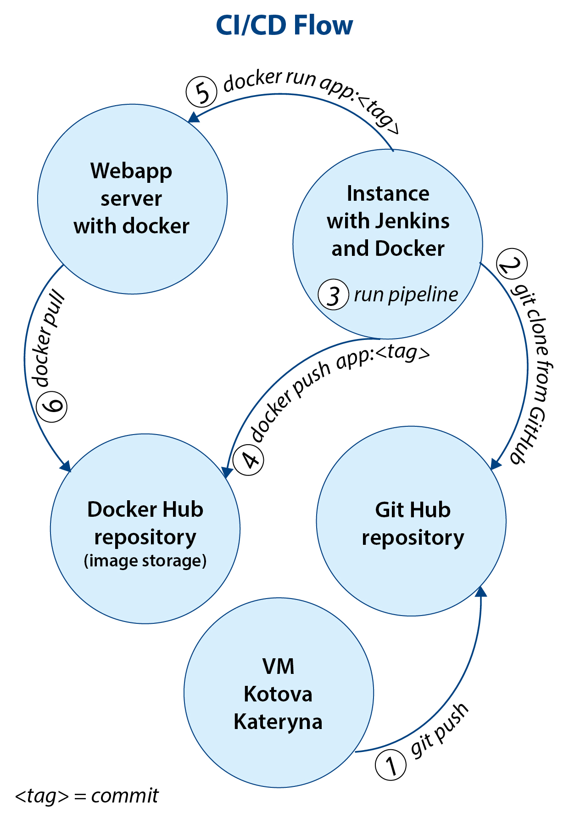

# Final project 

IT stack used:
1. Terraform - for creating two instances, security group and ssh key
2. Ansible - for install software Jenkins, Docker, Java
3. GitHub as application source repository 
4. DockerHub as image storage
5. Jenkins as CI/CD tool
6. Docker for packaging, delivering and running application
7. Python Flask framework for creating web application 

## CI/CD Flow

Details of project:

Create a Python Flask aplication named `web_app.py` that will give me pages about/main/user 
`python web_app.py` - run application. Works!

## Create Flask Tests and run them 

run test -run all test started with  "test*..."

## Build Docker image/push it to Docker hub/run docker
Create Dockerfile, Build the image `docker build -f Dockerfile -t app:v0.1.0 .`

Next steps:
- registry on `https://hub.docker.com/`
- rename my docker image - `docker tag app:v0.1.0 kotovak/webapp:v0.1.0`
- next `docker login`
- next `docker push kotovak/webapp:v0.1.0`
- next `docker rmi <image id> -f` - remove local image
- next `docker run -it -p 5000:5000 kotovak/webapp:v0.1.0` - run docker

Create repo on github for final_project where I will store the aplication and tests and Jenkinsfile and all another things needed for my project.

`terraform plan` & `terraform apply` - create two instances  
`ansible-playbook -i inventory.txt -b -u ubuntu webapp.yaml` - install docker on instance named 'weabapp'  
`docker ps` - check list of running containers
`ansible-playbook -i inventory.txt -b -u ubuntu jenkins.yaml` - install docker and jenkins on  another instance named 'jenkins'  
`ps -ef` - check install jenkins
Create the file `inventory.txt`and add names or ip instances to it
Then Jenkins run pipeline.
Jenkins' role here is that it will do git clone from the GitHub and run pipeline (run tests,after the tests, if they succeed, the jenskins will build docker image `docker build -f Dockerfile -t kotovak/app:$GIT_COMMIT .'`, push docker image `docker push kotovak/app:$GIT_COMMIT` and run docker image on my application server `docker run -p 80:5000 -d --name app kotovak/app:$GIT_COMMIT` 

That's all ;) the application works fine!

links that I used:
`https://www.theserverside.com/blog/Coffee-Talk-Java-News-Stories-and-Opinions/Complete-Jenkins-Git-environment-variables-list-for-batch-jobs-and-shell-script-builds`
(here environment variable of Jenkins i'll used GIT_COMMIT so that the name of the image coincides with the commit, since each commit is unique)  
`https://flask.palletsprojects.com/en/2.0.x/testing/` - link for testing Flask applications 
and a lot of videos on YouTube ))))