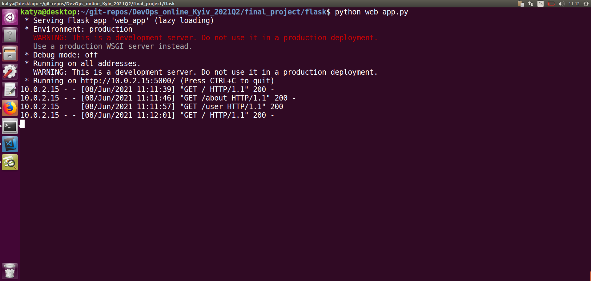
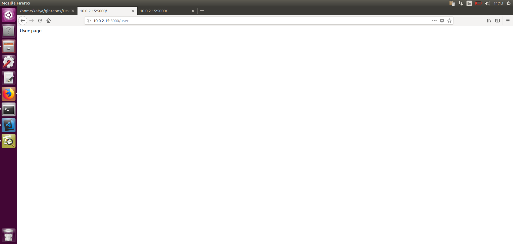
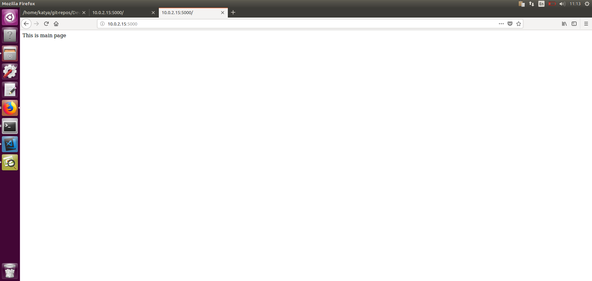
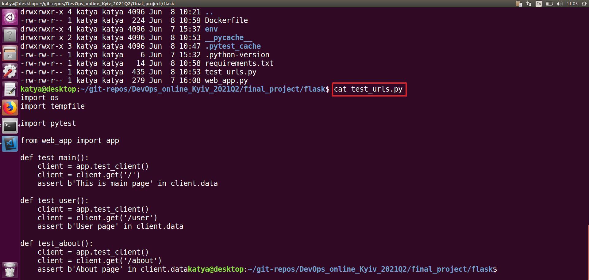
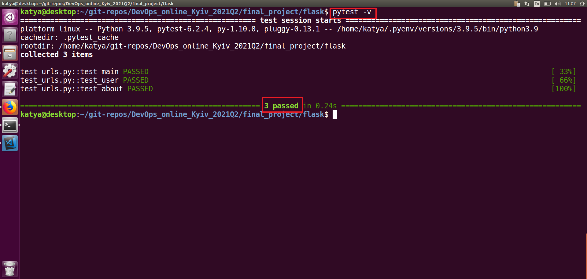
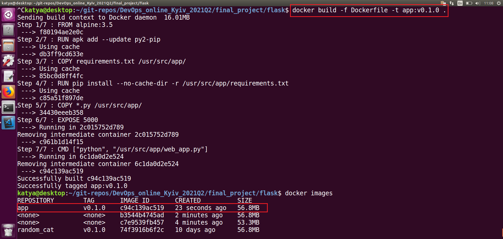
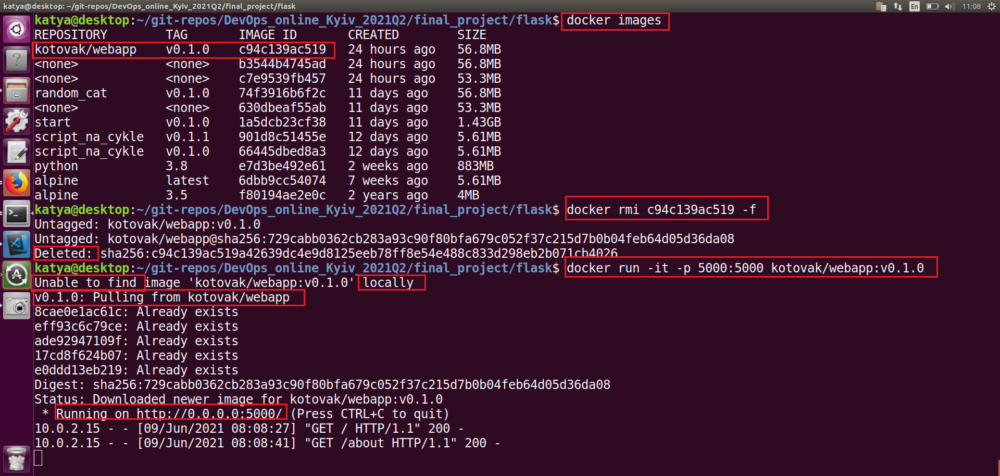

# Final project 
```
fgjdlfjgdfgld
```

Create a Python Flask aplication named `web_app.py` that will give me pages about/main/user 
`python web_app.py` - run application. Works!





## Create Flask Tests and run them 

run test -run all test started with  "test*..."


## Build Docker image/push it to Docker hub/run docker
Create Dockerfile, Build the image `docker build -f Dockerfile -t app:v0.1.0 .`


Next steps:
- registry on `https://hub.docker.com/`
- rename my docker image - `docker tag app:v0.1.0 kotovak/webapp:v0.1.0`
- next `docker login`
- next `docker push kotovak/webapp:v0.1.0`
- next `docker rmi <image id> -f` - remove local image
- next `docker run -it -p 5000:5000 kotovak/webapp:v0.1.0` - run docker


Create repo on github for final_project

`terraform plan` & `terraform apply` - create two instances
`ansible-playbook -i inventory.txt -b -u ubuntu webapp.yaml` - install docker on instance named 'weabapp'
`docker ps` - check list of running containers
`ansible-playbook -i inventory.txt -b -u ubuntu jenkins.yaml` - install docker and jenkins on  another instance named 'jenkins'


